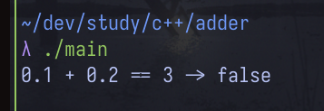

# threadline

A minimal diff tool written in Rust. Compares two text files line by line and outputs what was added, removed, or unchanged.

## Usage

```bash
cargo build --release
./target/release/threadline a.txt b.txt
```

## How it works

Uses the Longest Common Subsequence (LCS) algorithm to find lines that appear in both files in the same order. Everything not in the LCS is marked as added or removed.

## Output

```
  The cargo ship drifted slowly into the harbor just before dawn.
- Rust had formed along the lower hull, eating through decades of paint.
+ Rust had spread across the entire hull, eating through decades of paint.
  A single light flickered on the bridge, casting pale shadows on the water.
+ Fog had settled over the bay, muffling the sound of the engines.
```


